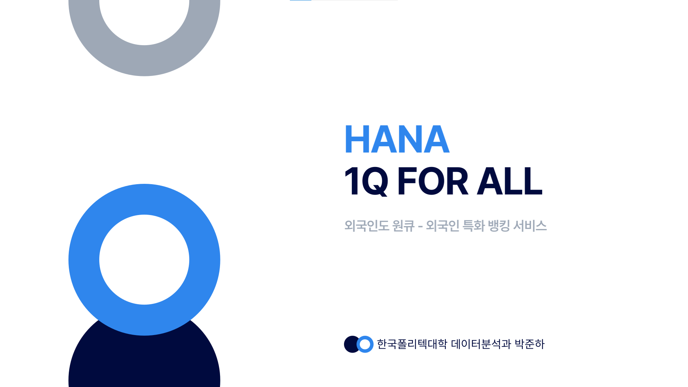
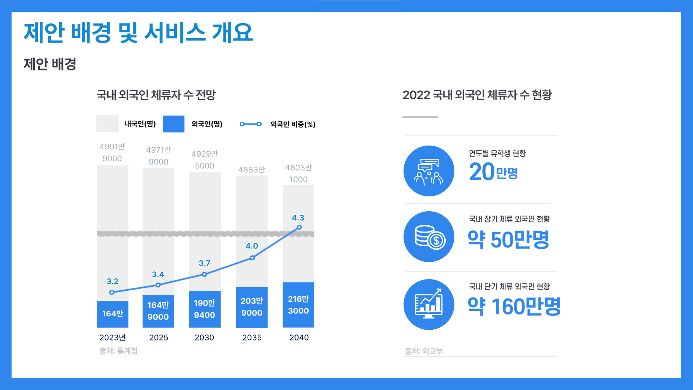
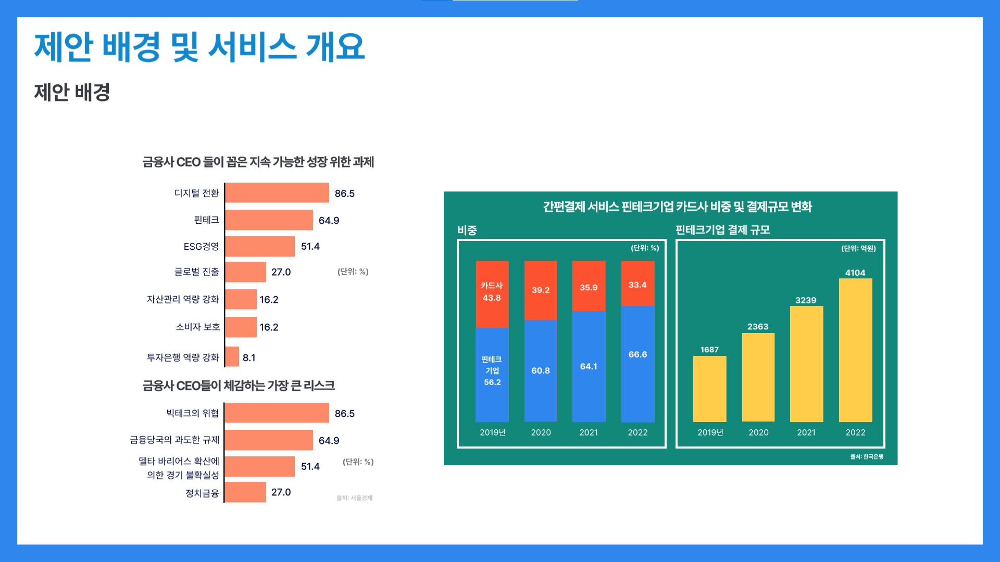
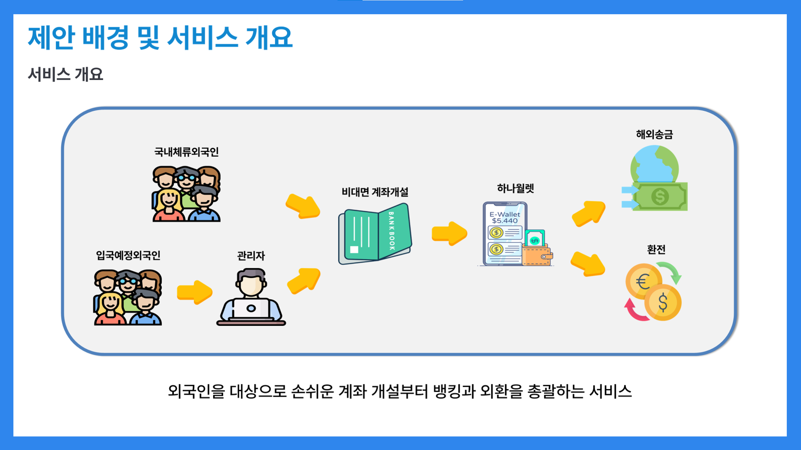
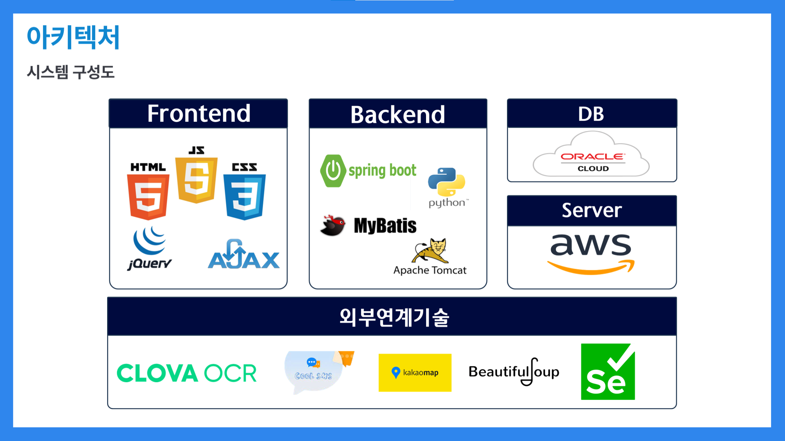
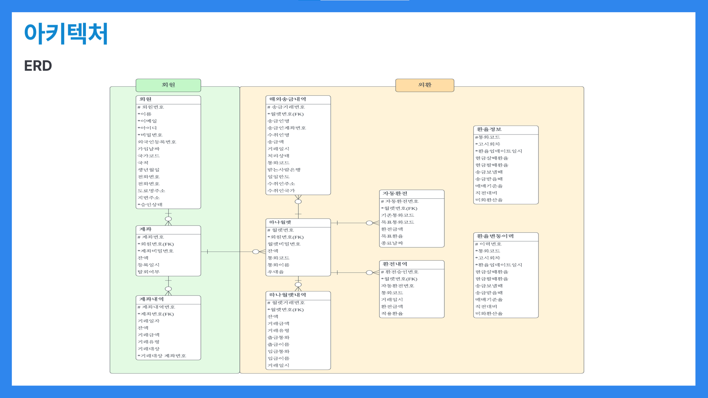
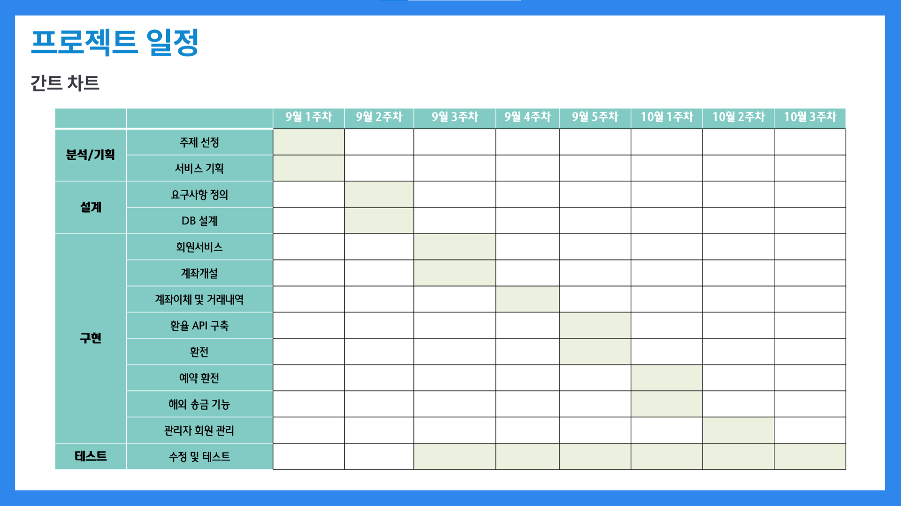
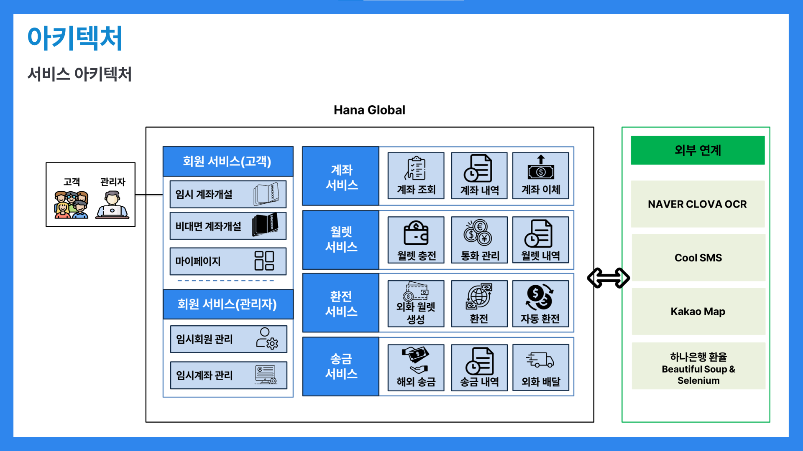
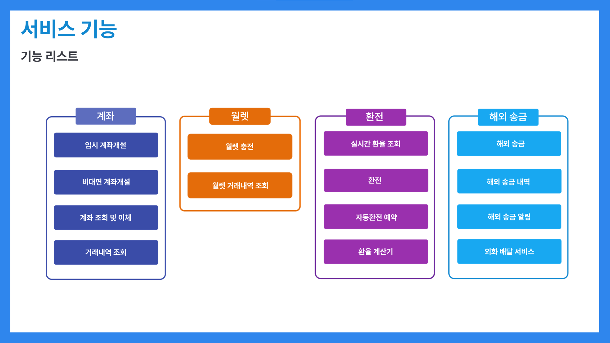
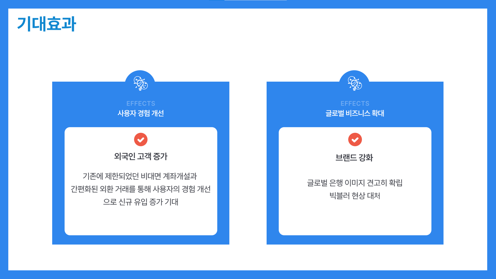

# 외국인도원큐 - Hana Global



## 1.프로젝트 개요
### 1.1 제안 배경



- 수요적 측면에서, 엔데믹 후 입국규제 완화 이후로 2022 장단기 체류 외국인이 약 225만 명 이상을 기록했다. 국내 체류 외국인이 계속 증가할 추세로 보이는 가운데, 외국인 거주자는 여전히 제도적 한계로 비대면 금융서비스를 이용하기 쉽지 않다.




- 금융산업의 측면에서, 핀테크 기업이 금융서비스에 발을 뻗고 있고, 코로나 이후로 특히 실제로 금융기업의 서비스 점유를 위협하고 있다. 이러한 조건들이 맞물린 상황에서 하나은행이 국내의 여타 기업보다 외환 거래 시스템이 잘 구축이 되어있어 이 강점을 강화하면 더욱 경쟁력이 생길 것이라고 생각하여 프로젝트를 진행해보았다.

### 1.2 서비스 개요


- 기존의 하나은행의 비대면 계좌개설 서비스와 외국인 특화 플랫폼 Hana EZ를 발전시켜, 국내 외국인이 쉽게 접근할 수 있고, 하나의 플랫폼에서 비대면 금융 서비스를 손쉽게하는 서비스를 목표로 하였다.

## 2. 프로젝트 설계

### 2-1. 개발 환경
```
- OS : Windows, Ubuntu20
- DB : Oracle
- Language : Java, JavaScript, Python
- IDE : IntelliJ, VSCode, SQLDeveloper
- Framework : SpringBoot, MyBatis
- Server : apache, tomcat9
- Cloud : Oracle Cloud
- VCS : Github
```

### 2-2. 시스템 아키텍처



### 2-3. ERD



### 2-4. 개발 일정



## 3. 서비스 기능

### 3-1. 기능 리스트

<br/>



### 3-2. 기대효과



- 비대면 금융 서비스에 여전히 소외 계층인 외국인 근로자 및 신규 가입자들이 계좌 개설을 더욱 간편하게 하고, 월렛을 통해 외화를 더욱 편하게 관리하면서 자동환전과 배달서비스를 통해 해외 송금 및 금융 거래를 효율적으로 수행할 수 있는 서비스를 제공함으로써 국내 체류 외국인들의 금융 접근성을 향상 시키고 금융 서비스 이용의 불편을 최소화할 수 있을 것으로 기대한다


## 4. 발표 ppt
[발표 PPT 보기](외국인도원큐_이정민.pdf)

## 5. 본인소개

<table>
    <tr>
        <th style="width: 150px;">항목</th>
        <th style="width: 400px;">내용</th>
        <th></th>
    </tr>
    <tr>
        <td>이름</td>
        <td>박준하</td>
        <td></td>
    </tr>
    <tr>
        <td>연락처</td>
        <td>이메일</td>
        <td>njk116@gmail.com</td>
    </tr>
    <tr>
        <td>학력사항</td>
        <td>졸업(2023.02)</td>
        <td>한국외국어대학교 컴퓨터전자시스템공학과</td>
    </tr>
    <tr>
        <td rowspan="2">자격증</td>
        <td>2022.07</td>
        <td>정보처리기사 필기(한국산업인력공단)</td>
    <tr>
        <td>2023.07</td>
        <td>SQLD (한국데이터산업진흥원)</td>
    </tr>
    <tr>
        <td rowspan="2">skill set</td>
        <td>Frontend</td>
        <td>HTML, CSS, Javascript</td>
    </tr>
    <tr>
        <td>Backend</td>
        <td>Java, SpringBoot, Python</td>
    </tr>
    <tr>
        <td rowspan="1">교육이력</td>
        <td>2023.03 ~ 2023.10</td>
        <td>하나금융티아이 채용전환형 교육 1200시간(한국폴리텍대학교 광명융합기술교육원 - 데이터분석과)</td>
    </tr>
</table>